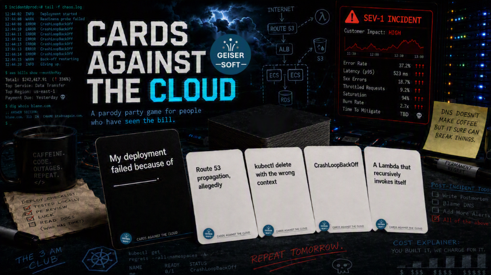

# Cards Against the Cloud

* measured monthly, excluding scheduled maintenance, unscheduled maintenance, us-east-1, and any period we would rather not discuss.

---

Somewhere between your first surprise invoice and your fourth 3 a.m. page, you develop a sense of humor about all this. Cards Against the Cloud is that sense of humor, printed on 550 cards and handed to your team at happy hour.

It is what happens when Cards Against Humanity gets an AWS certification and Magic: The Gathering discovers CloudFormation. A party game for cloud architects, DevOps engineers, platform teams, security people who have stopped being surprised by anything, and that one person who insists their Terraform module is basically art. The cards mix dark humor, cloud jargon, and just enough Lambda cold start lag to make any architect cry.

If you have ever explained a five figure bill to a CFO who thought the cloud was free, you already know how to play.

## What is in the deck

One hundred black cards ask the question. Four hundred fifty white cards are the reason you are not sleeping tonight. AWS carries the most weight, because AWS causes the most suffering, but Azure, GCP, and OCI all get what is coming to them. Kubernetes, Terraform, IAM, FinOps, on-call, AI hype, and the general indignity of enterprise IT are represented in proportion to how much of your week they consume.

Everything in the deck is original. Nothing was copied from anywhere. Some of it was, however, lived.

## How to play

Deal ten white cards to each player. One player is the judge, and the traditional method for picking the first one is whoever got paged most recently. The judge draws a black card and reads it out loud. Everyone else picks the white card from their hand that they think will land hardest and passes it in face down, because anonymity is the only part of this game with proper access controls.

The judge shuffles the submissions, reads each combination out loud with commitment, and picks a winner. The winner keeps the black card. We call these Service Credits, which is fitting, because they are worth almost nothing and you have to ask for them. Everyone draws back up to ten, the judge role rotates left the same way on-call does, and you go again.

First to seven Service Credits wins. In practice you will play until the pizza runs out, which is the more honest ending anyway.

Full rules, including nine optional house rules, live in the instructions document.

## Print it

The two card documents are laid out nine cards per page at 2.5 by 3.5 inches, the standard playing card size. Three things to get right:

1. Print at 100% scale. Turn off "fit to page" and "shrink oversized pages," which shift the cut lines in ways you will notice by card forty.
2. Start on page 2 of each file. Page 1 is the cover sheet.
3. Cut along the gray grid lines. A paper trimmer will save you roughly an hour of your life compared to scissors.

Cardstock in the 200 to 300 gsm range feels like a real deck. Plain paper works fine for a first playtest and costs almost nothing, which is more than can be said for the subject matter. Print the white deck first, because the black cards use a full bleed black fill and will make your printer file a complaint with HR.

## What is in this repo

| File | What it is |
| --- | --- |
| `Cards_Against_the_Cloud_INSTRUCTIONS.docx` | Rules of play, house rules, printing notes |
| `Cards_Against_the_Cloud_BLACK_CARDS.docx` | 100 prompt cards, print ready |
| `Cards_Against_the_Cloud_WHITE_CARDS.docx` | 450 answer cards, print ready |
| `CAtC_hero.png` | The image at the top of this page |
| `LICENSE` | Creative Commons Attribution 4.0 International |

## Player base

The AWS edition has the largest player base by a wide margin, millions more than Azure, GCP, and OCI combined. The Azure edition is growing steadily, mostly through enterprise agreements nobody remembers signing. The GCP edition is excellent and will be deprecated in eighteen months.

The OCI edition has yet to record a single completed game. Oracle is not accepting new customers at this time. Also, it is OCI.

## Contributing a card

Open an issue or a pull request. The bar is simple: it has to be true enough to hurt and short enough to fit on a card. If it takes a paragraph of setup to land, it belongs in a postmortem, not in the deck.

Cards that are specific beat cards that are general. "A NAT Gateway nobody remembers creating" works. "Cloud costs" does not. If your card names a real coworker, congratulations on the catharsis, but change the name before you submit it.

## A note on content

The deck leans dark, sarcastic, and occasionally suggestive, in the tradition of the game it parodies. It stays away from anything built on racism, abuse, or explicit material. If a card does not suit your group, pull it. There are 550 of them and nobody will miss one. Skimming the deck before you hand it to your team offsite is time well spent, and it is the closest thing this game has to a pre-deployment check.

## License

Copyright Geisersoft ([geisersoft.com](https://www.geisersoft.com)), released under the [Creative Commons Attribution 4.0 International License](https://creativecommons.org/licenses/by/4.0/).

You can share it, print it, remix it, expand it, and use it commercially, without asking permission and without paying anyone. One condition. Give credit. Name Geisersoft as the original creator, link back to the license, and say whether you changed anything.

If you are looking for the attribution line to copy:

> Cards Against the Cloud © Geisersoft (www.geisersoft.com), licensed under CC BY 4.0. Changes were made.

Two things the license does not cover. The Geisersoft name and logo are excluded, so build on the deck all you want, just do not ship your version under our branding. And there is no warranty of any kind. The deck is provided as-is. If a card ends a friendship or gets you invited to a conversation with HR, that is between you and the table.

## Fine print

Cards Against the Cloud is a parody. It is not affiliated with, endorsed by, or connected to Cards Against Humanity LLC, Amazon Web Services, Microsoft, Google, Oracle, IBM, or any other company named on a card. All product names belong to their respective owners, who are presumably too busy shipping features to care.

No production systems were harmed in the making of this deck. Several were harmed independently, which is where most of the material came from.
